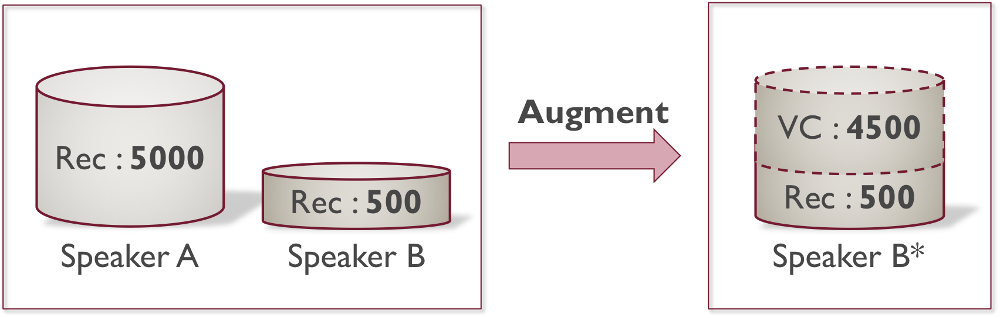
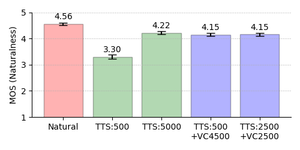

# Authors
- Ryo Terashima
- Ryuichi Yamamoto
- Kentaro Tachibana

 
# Abstruct

　特定話者の数千発話のデータを用いて，高品質なテキスト音声合成 (text-to-speech; TTS) を実現することが可能である．その一方，数千発話規模の音声収録やアノテーションにかかるコストは大きい．本稿では，対象話者  (Speaker B) の少量のデータから TTS モデルを構築するために，他話者  (Speaker A) とのデータ間で声質変換 (voice conversion; VC) を行い，対象話者のデータを拡張する方式の検討を行った． 
　主観評価の結果，対象話者 5,000 発話で学習したモデルに対し，自然性評価では，対象話者 500 発話を用いてデータ拡張したモデルが匹敵する結果となり，話者類似性評価では，対象話者 2,500 発話を用いてデータ拡張したモデルが匹敵する結果となった．

<!---->

 
# Subjective Evaluation

## Models

| Model              | Type                 | VC Training [utts] | TTS Training [utts] |
|--------------------|:--------------------:|:------------------:|:-------------------:|
| **Natural** | Recorded audio (Speaker B)| - | - |
| **VC Source** | Recorded audio (Speaker A)| - | - |
| **TTS:500** | TTS | - | 500(Rec) |
| **TTS:5000** | TTS | - | 5000(Rec) |
| **TTS:500+VC4500** | TTS with VC data augmentation | 500:500(Rec) | 500(Rec)+4500(VC) |
| **TTS:2500+VC2500** | TTS with VC data augmentation | 2500:2500(Rec) | 2500(Rec)+2500(VC) |

- **VC:** Scyclone \[1\]
- **TTS:** FastSpeech 2 \[2\]
- **Vocoder:** Harmonic-plus-noise Parallel WaveGAN \[3\]

<!--
## 5-Point MOS Results on Naturalness

| Model                   | Female               | Male                |
|-------------------------|:--------------------:|:-------------------:|
| **Natural** | 4.56 ± 0.05 | 4.28 ± 0.06 |
| **TTS:500** | 3.30 ± 0.08 | 3.38 ± 0.08 |
| **TTS:5000** | 4.22 ± 0.06 | 4.04 ± 0.06 |
| **TTS:500+VC4500** | 4.15 ± 0.06 | 3.99 ± 0.07 |
| **TTS:2500+VC2500** | 4.15 ± 0.06 | 4.08 ± 0.06 |

## 4-Point MOS Results on Similarity

| Model                   | Female               | Male                |
|-------------------------|:--------------------:|:-------------------:|
| **VC Source** | 1.63 ± 0.06 | 1.15 ± 0.03 |
| **TTS:500** | 3.12 ± 0.07 | 2.94 ± 0.08 |
| **TTS:5000** | 3.70 ± 0.05 | 3.71 ± 0.05 |
| **TTS:500+VC4500** | 3.46 ± 0.06 | 2.92 ± 0.08 |
| **TTS:2500+VC2500** | 3.66 ± 0.05 | 3.70 ± 0.05 |
-->

 
## 5-Point MOS Results on Naturalness
- Female 

- Male 

## 4-Point MOS Results on Similarity
- Female 

- Male 

 
# Audio Samples

## Sample 1

| Model                   | Female               | Male                |
|-------------------------|:--------------------:|:-------------------:|
| **Natural** | <audio controls src="./asj2021autumn/samples/natural/fyma05051.wav"></audio> | <audio controls src="./asj2021autumn/samples/natural/mksk05051.wav"></audio> |
| **VC Source** | <audio controls src="./asj2021autumn/samples/vc_sorce/fmkm05051.wav"></audio> | <audio controls src="./asj2021autumn/samples/vc_sorce/mtsk05051.wav"></audio> |
| **TTS:500** | <audio controls src="./asj2021autumn/samples/tts500/fyma05051_gen.wav"></audio> | <audio controls src="./asj2021autumn/samples/tts500/mksk05051_gen.wav"></audio> |
| **TTS:5000** | <audio controls src="./asj2021autumn/samples/tts5000/fyma05051_gen.wav"></audio> | <audio controls src="./asj2021autumn/samples/tts5000/mksk05051_gen.wav"></audio> |
| **TTS:500+VC4500** | <audio controls src="./asj2021autumn/samples/tts500+vc4500/fyma05051_gen.wav"></audio> | <audio controls src="./asj2021autumn/samples/tts500+vc4500/mksk05051_gen.wav"></audio> |
| **TTS:2500+VC2500** | <audio controls src="./asj2021autumn/samples/tts2500+vc2500/fyma05051_gen.wav"></audio> | <audio controls src="./asj2021autumn/samples/tts2500+vc2500/mksk05051_gen.wav"></audio> |

## Sample 2

| Model                   | Female               | Male                |
|-------------------------|:--------------------:|:-------------------:|
| **Natural** | <audio controls src="./asj2021autumn/samples/natural/fyma05137.wav"></audio> | <audio controls src="./asj2021autumn/samples/natural/mksk05137.wav"></audio> |
| **VC Source** | <audio controls src="./asj2021autumn/samples/vc_sorce/fmkm05137.wav"></audio> | <audio controls src="./asj2021autumn/samples/vc_sorce/mtsk05137.wav"></audio> |
| **TTS:500** | <audio controls src="./asj2021autumn/samples/tts500/fyma05137_gen.wav"></audio> | <audio controls src="./asj2021autumn/samples/tts500/mksk05137_gen.wav"></audio> |
| **TTS:5000** | <audio controls src="./asj2021autumn/samples/tts5000/fyma05137_gen.wav"></audio> | <audio controls src="./asj2021autumn/samples/tts5000/mksk05137_gen.wav"></audio> |
| **TTS:500+VC4500** | <audio controls src="./asj2021autumn/samples/tts500+vc4500/fyma05137_gen.wav"></audio> | <audio controls src="./asj2021autumn/samples/tts500+vc4500/mksk05137_gen.wav"></audio> |
| **TTS:2500+VC2500** | <audio controls src="./asj2021autumn/samples/tts2500+vc2500/fyma05137_gen.wav"></audio> | <audio controls src="./asj2021autumn/samples/tts2500+vc2500/mksk05137_gen.wav"></audio> |

 
# References
- \[1\]: 金垣葵, 田中雅也, 能勢隆, 清水遼平, 伊藤彰則, “スペクトログラムを用いた CycleGAN に基づく高品質ノンパラレル声質変換,” 日本音響学会2020年秋季研究発表会講演論文集, 2020．
- \[2\]: Yi Ren, Chenxu Hu, Xu Tan, Tao Qin, Sheng Zhao, Zhou Zhao and Tie-Yan Liu, “FastSpeech 2: Fast and high-quality end-to-end text-to-speech,” In Proc. ICLR, 2021.
- \[3\]: Min-Jae Hwang, Ryuichi Yamamoto, Eunwoo Song and Jae-Min Kim, “High-fidelity Parallel WaveGAN with multi-band harmonic-plus-noise model,” In Proc. INTERSPEECH (in press), 2021.
